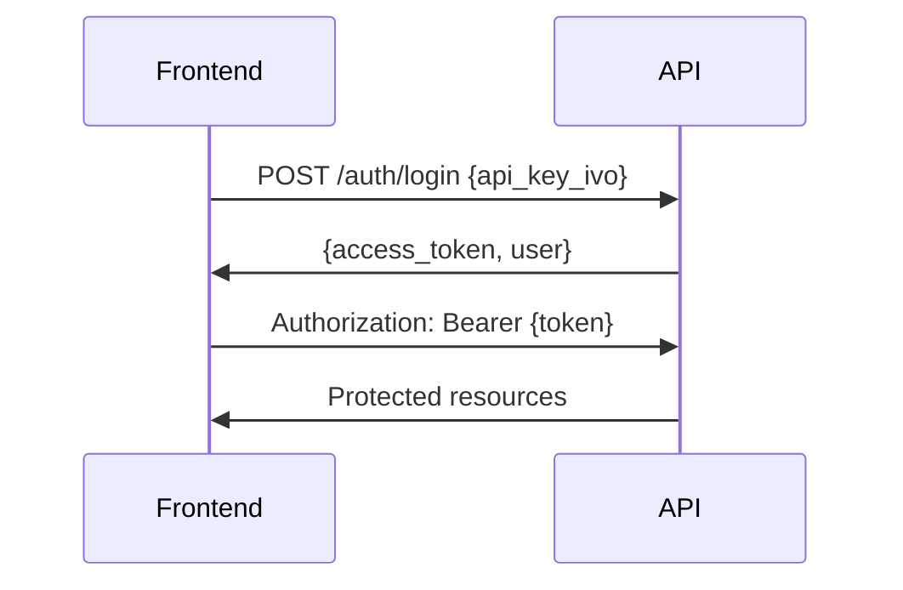

# 🚀 IVO V2 Frontend

Sistema avançado de geração hierárquica de materiais didáticos para ensino de idiomas com IA generativa.

## 📋 Pré-requisitos

- **Node.js** 18.17.0 ou superior
- **npm** 9.0.0 ou superior  
- **API Backend** rodando em `http://localhost:8000`

## ⚡ Quick Start

```bash
# 1. Instalar dependências
npm install

# 2. Verificar se a API está rodando (deve estar em localhost:8000)
# curl http://localhost:8000/health

# 3. Iniciar o servidor de desenvolvimento
npm run dev

# 4. Abrir no navegador
# http://localhost:3000
```

## 🎯 Status do Desenvolvimento

### ✅ FASE 1 - Foundation (CONCLUÍDA)
- [x] Estrutura Next.js 14 + TypeScript + Tailwind
- [x] Design system IVO V2 com cores semânticas
- [x] Configurações avançadas (bundle splitting, otimizações)
- [x] Sistema de tipos TypeScript completo
- [x] Providers (TanStack Query, Theme)
- [x] Utilities e constants

### 🚧 FASE 2 - Core UI (EM DESENVOLVIMENTO)  
- [ ] Sistema de autenticação NextAuth.js v5
- [ ] API client com interceptors e rate limiting
- [ ] Components base shadcn/ui
- [ ] DataTable avançada TanStack
- [ ] Layout dashboard responsivo

### ⏳ PRÓXIMAS FASES
- **FASE 3**: Implementação de features (páginas, wizards, editores)
- **FASE 4**: Features avançadas (3D loading, PDF, WebSocket)  
- **FASE 5**: Polish & Deploy (testes, CI/CD)

## 🏗️ Arquitetura

```
Frontend (Next.js 14)     Backend (FastAPI)
├── localhost:3000   ←→   localhost:8000
├── TypeScript            Python
├── Tailwind CSS          SQLAlchemy
├── NextAuth.js           OpenAI GPT
├── TanStack Query        Supabase
└── shadcn/ui             RAG System
```

## 🎨 Design System

### Cores Principais
- **Primary**: `#FF4757` (IVO Red)
- **Secondary**: `#00D2FF` (IVO Blue) 
- **Success**: `#10B981` (Green)
- **Background**: `#2B3544` (Dark Canvas)

### Typography
- **Sans**: Inter (UI/Content)
- **Mono**: JetBrains Mono (Code/Data)

## 📂 Estrutura do Projeto

```
C:/Ivo-FRONT/
├── app/                    # Next.js 14 App Router
│   ├── (auth)/            # Auth routes group
│   ├── (dashboard)/       # Protected routes  
│   └── globals.css        # Global styles
├── components/            # React components
│   ├── ui/               # Base UI components
│   └── features/         # Feature components
├── lib/                   # Core utilities
│   ├── types/            # TypeScript definitions
│   ├── constants/        # App constants
│   └── utils.ts          # Utility functions
├── hooks/                 # Custom React hooks
└── store/                 # Zustand stores
```

## 🔑 Variáveis de Ambiente

```bash
# .env.local
NEXT_PUBLIC_API_URL=http://localhost:8000
NEXT_PUBLIC_WS_URL=ws://localhost:8000  
NEXT_PUBLIC_FRONTEND_URL=http://localhost:3000
NEXTAUTH_SECRET=your-secret-here
TEST_API_KEY_IVO=ivo_test_token_dev_only
```

## 🛠️ Scripts Disponíveis

```bash
npm run dev        # Servidor desenvolvimento (porta 3000)
npm run build      # Build para produção
npm run start      # Servidor produção  
npm run lint       # ESLint
npm run type-check # TypeScript check
```

## 📡 Integração com API

O frontend consome a API IVO V2 que deve estar rodando em `localhost:8000`:

### Endpoints Principais
- `POST /api/auth/login` - Autenticação
- `GET /api/v2/courses` - Listar cursos
- `GET /api/v2/units` - Listar unidades  
- `POST /api/v2/units/{id}/vocabulary` - Gerar vocabulário

### Fluxo de Autenticação


## 🎯 Próximos Passos

1. **Implementar NextAuth.js** para autenticação completa
2. **Criar API client** com retry e rate limiting  
3. **Desenvolver components base** shadcn/ui
4. **Implementar DataTable** para listagens
5. **Criar layout dashboard** com sidebar

## 🐛 Troubleshooting

### API não responde
```bash
# Verificar se API está rodando
curl http://localhost:8000/health

# Se não estiver, iniciar API backend
cd C:/Ivo-API
docker-compose up
```

### Erro de dependências
```bash
# Limpar cache e reinstalar
rm -rf node_modules package-lock.json
npm install
```

### Erro de TypeScript
```bash
# Verificar tipos
npm run type-check

# Limpar cache Next.js
rm -rf .next
npm run dev
```

## 📞 Suporte

Para dúvidas sobre o desenvolvimento:
- Verificar documentação da API em `/docs`
- Consultar tipos TypeScript em `lib/types/`
- Revisar componentes de exemplo em `app/(dashboard)/`

---

**IVO V2** - Desenvolvido com ❤️ usando Next.js 14 + TypeScript + Tailwind CSS